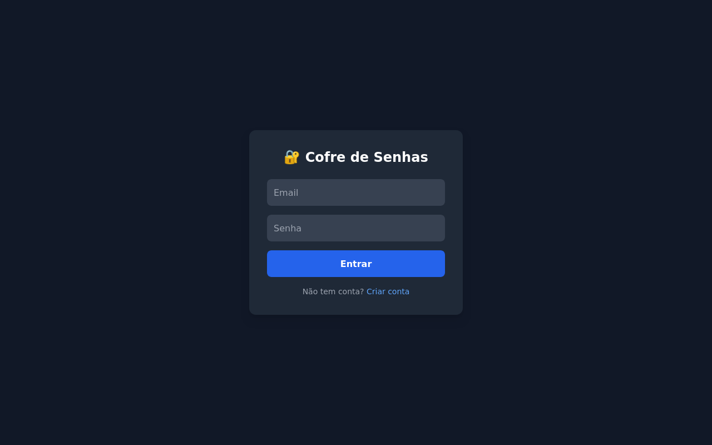
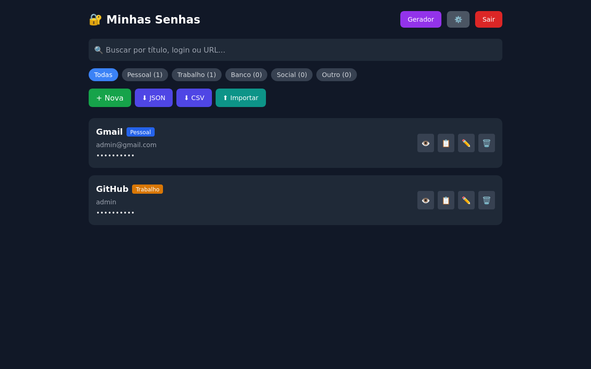
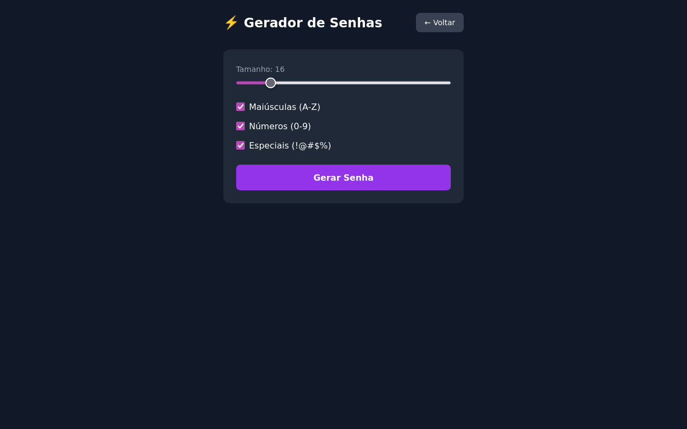

🌐 [Português](README.md) | [English](README.en.md)

# 🔐 Caja Fuerte de Contraseñas

[](https://github.com/DanielHoffmannO/CofreSenhas/actions)


> Gestor de contraseñas personal con cifrado fuerte, autenticación 2FA y extensión de navegador -- modelo zero-knowledge.
>
> Backend reescrito desde cero en Rust idiomático (antes era .NET/ASP.NET Core), manteniendo el mismo frontend React y el mismo contrato de API.

## Capturas de pantalla

| Login | Dashboard | Generador |
|:-----:|:---------:|:---------:|
|  |  |  |

## Tech Stack

| Capa | Tecnología |
|------|-----------|
| Front-end | React 18 + TypeScript + Tailwind CSS + Vite |
| Back-end | Rust + axum (Web API) |
| Base de datos | SQLite (embebida, vía rusqlite) |
| Auth | JWT (Bearer Token) + 2FA (TOTP) |
| Cifrado | ChaCha20-Poly1305 (contraseñas) + Argon2 (contraseña de cuenta) |
| Infra | Docker Compose |
| Extensión | Extensión de navegador (Firefox / LibreWolf) |

## Cómo Ejecutar

```bash
cp .env.example .env   # ajusta puertos/secretos si hace falta
docker-compose up --build
```

| Servicio | URL |
|----------|-----|
| Front-end | http://localhost:8080 |
| API | http://localhost:5000/api |
| Health check | http://localhost:5000/health |

> ⚠️ **`JWT_SECRET` y `ENCRYPTION_SECRET` en `.env` deben ser valores fuertes y únicos** (ej.: `openssl rand -base64 48`) antes de guardar contraseñas reales -- los valores por defecto del código son públicos. `ENCRYPTION_SECRET` deriva la clave que cifra las contraseñas en la base de datos: **cambiarlo después de guardar datos los vuelve ilegibles para siempre.** Guárdalo en un lugar seguro (gestor de contraseñas, caja fuerte) -- perder el `.env` sin backup es perder toda la caja fuerte.

### Backup

La base de datos es un único archivo SQLite (`cofresenhas.db`, o el volumen `api-data` en Docker). No hay backup automático. Se recomienda:

```bash
# Backup consistente incluso con el servidor corriendo (SQLite online backup)
sqlite3 cofresenhas.db ".backup cofresenhas-backup-$(date +%Y%m%d).db"
```

Ejecuta esto periódicamente (cron/systemd timer) y guarda la copia fuera de la máquina.

### Sin Docker (dev)

```bash
# API (puerto 5000 por defecto)
cargo run --bin server

# Front-end
cd frontend && npm install && npm run dev
```

El front-end (`vite dev`, puerto 3000) ya tiene configurado un proxy para `/api` -> `http://localhost:5000`.

### CLI local (bonus)

Este mismo binario de Rust también expone una CLI independiente, de un solo usuario, sin necesidad del servidor web -- útil para uso personal por terminal:

```bash
cargo run --bin cofresenhas -- init
cargo run --bin cofresenhas -- add github mi-usuario
```

Ver [`src/cli.rs`](src/cli.rs) y los módulos `crypto`/`storage`/`vault` para más detalles.

## Funcionalidades

- ✅ Login y registro con JWT + Autenticación 2FA (TOTP)
- ✅ Contraseñas cifradas (ChaCha20-Poly1305) en la base de datos -- modelo zero-knowledge
- ✅ CRUD completo de contraseñas
- ✅ Generador configurable (tamaño, mayúsculas, números, especiales)
- ✅ Indicador de fuerza (Débil -> Muy Fuerte)
- ✅ Extensión de navegador (Firefox / LibreWolf) con sugerencia automática de autocompletado
- ✅ Exportar/Importar (JSON y CSV, con detección de duplicados al importar)
- ✅ Copiar con 1 clic + Mostrar/ocultar
- ✅ Interfaz dark mode responsiva
- ✅ Health check

> El rate limiting de login, una master password separada y el historial de versiones existían en el backend .NET original o en versiones anteriores de este; se dejaron fuera de la reescritura en Rust a propósito porque no justificaban su costo de mantenimiento sin uso real -- ver la filosofía del proyecto.

## Arquitectura

```
src/
├── lib.rs           ← punto de entrada de la lib compartida
├── bin/
│   ├── server.rs     ← entrada del servidor web (axum)
│   └── cofresenhas.rs ← entrada de la CLI independiente
├── crypto/           ← Argon2 (hash) + ChaCha20-Poly1305 (cifrado) -- usado por CLI y server
├── storage/, vault.rs, cli.rs  ← CLI local de un solo usuario
└── server/           ← API web multiusuario
    ├── db.rs          ← pool SQLite + schema
    ├── auth.rs        ← JWT, hash de contraseña, TOTP
    ├── models.rs       ← DTOs (mismo contrato JSON que el frontend)
    └── handlers/       ← rutas: auth, contraseñas, generador
frontend/
└── React + TypeScript + Tailwind + Vite
extension/
└── Extensión de navegador (Manifest V2 -- Firefox / LibreWolf)
```

## Tests

```bash
cargo test
```

## Licencia

Este proyecto está bajo la licencia [MIT](LICENSE).
