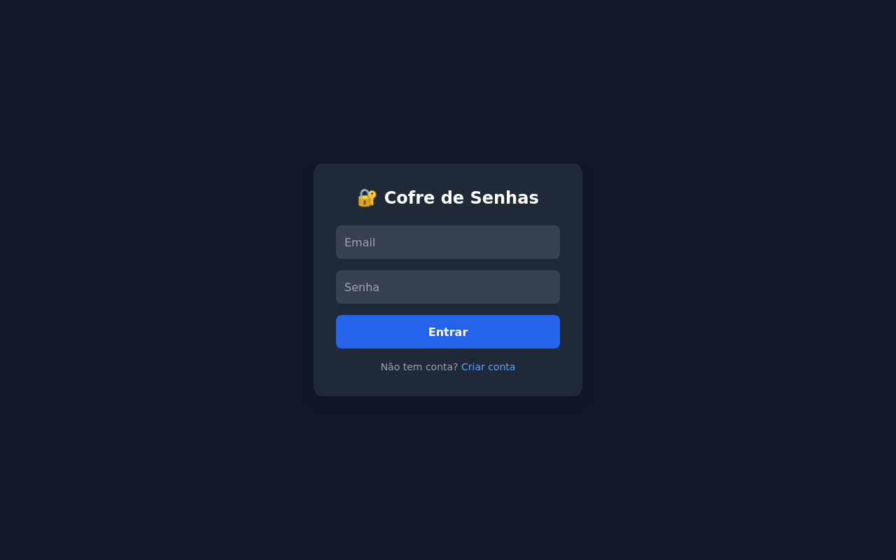
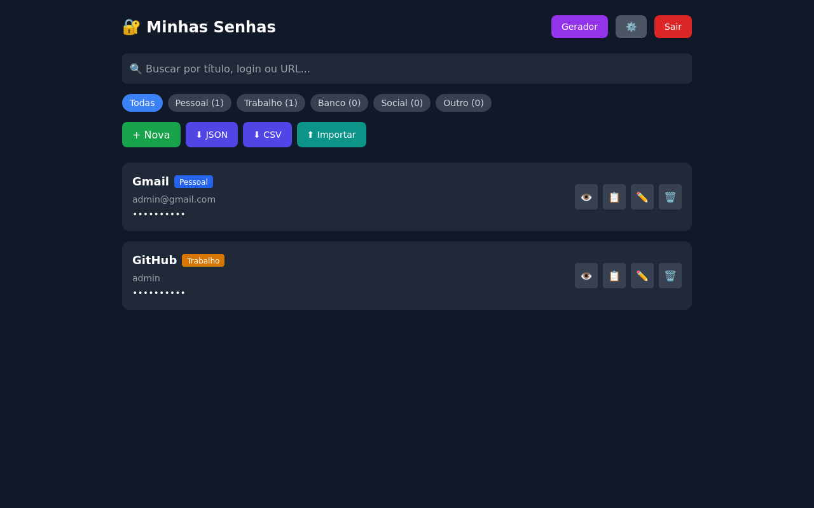
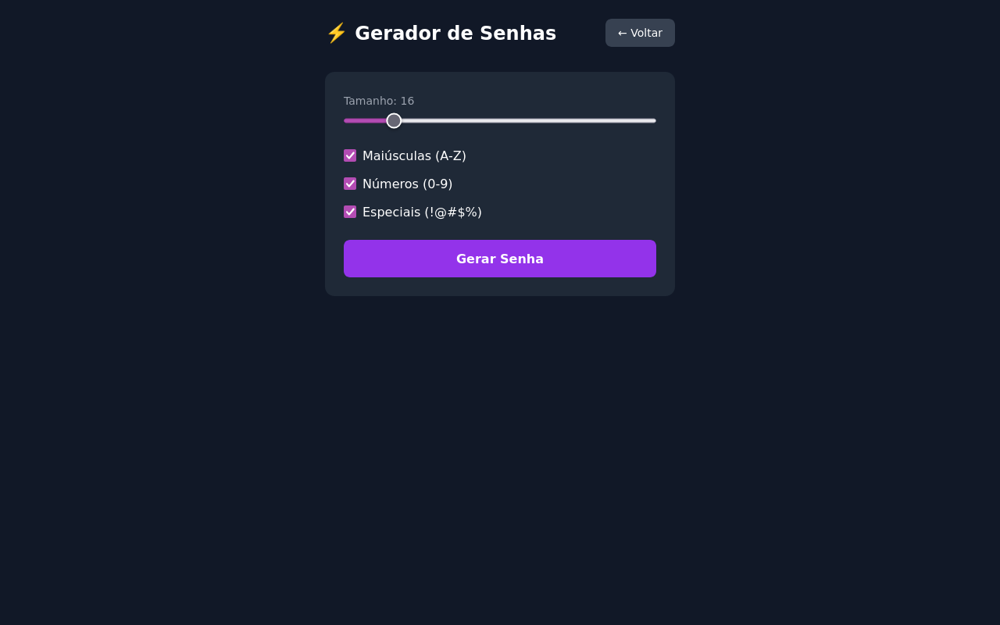

🌐 [English](README.en.md) | [Español](README.es.md)

# 🔐 Cofre de Senhas

[](https://github.com/DanielHoffmannO/CofreSenhas/actions)


> Gerenciador de senhas pessoal com criptografia AES-256, autenticação 2FA e extensão para browser — modelo zero-knowledge.

## 📸 Screenshots

| Login | Dashboard | Gerador |
|:-----:|:---------:|:-------:|
|  |  |  |

## 🛠️ Tech Stack

| Camada | Tecnologia |
|--------|-----------|
| Front-end | React 18 + TypeScript + Tailwind CSS + Vite |
| Back-end | .NET 9 / ASP.NET Core Web API |
| Banco | PostgreSQL 16 |
| Auth | JWT (Bearer Token) + 2FA (TOTP) |
| Criptografia | AES-256 + PBKDF2 Key Derivation (100k iterações) |
| Infra | Docker Compose |
| Extensão | Browser Extension (Firefox / LibreWolf) |

## 🚀 Como Rodar

```bash
cp .env.example .env   # ajuste as portas se necessário
docker-compose up --build
```

| Serviço | URL |
|---------|-----|
| Front-end | http://localhost:8080 |
| API (Swagger) | http://localhost:5000/swagger |

### Sem Docker (dev)

```bash
# API
dotnet run --project src/CofreSenhas.Api

# Front-end
cd frontend && npm install && npm run dev
```

### Dados de Teste

| Email | Senha |
|-------|-------|
| admin@cofre.com | admin123 |

## ✨ Features

- 🔑 Login e registro com JWT + Autenticação 2FA (TOTP)
- 🔒 Senhas criptografadas (AES-256) no banco — modelo zero-knowledge
- 🗝️ Master Password com Key Derivation (PBKDF2 100k iterações)
- 📝 CRUD completo de senhas com histórico de versões
- ⚡ Gerador configurável (tamanho, maiúsculas, números, especiais)
- 📊 Indicador de força (Fraca → Muito Forte)
- 🧩 Extensão para browser (Firefox / LibreWolf) com auto-fill
- 📤 Export/Import (JSON e CSV)
- 📋 Copiar com 1 clique + Mostrar/ocultar
- 🌙 Interface dark mode responsiva
- 🛡️ Rate Limiting (anti brute-force) + Auditoria de acessos
- ❤️ Health Checks

## 🏗️ Arquitetura

```
src/
├── CofreSenhas.Domain        ← Entidades, DTOs, Interfaces, Enums
├── CofreSenhas.Service       ← Regras de negócio (Auth, Senhas, Gerador)
├── CofreSenhas.Persistence   ← EF Core + PostgreSQL, Repositories
└── CofreSenhas.Api           ← Controllers, JWT, Swagger
frontend/
└── React + TypeScript + Tailwind + Vite
extension/
└── Browser Extension (Manifest V2 — Firefox / LibreWolf)
tests/
└── CofreSenhas.Tests         ← xUnit (Auth, Senhas, Gerador)
```

## 🧪 Testes

```bash
dotnet test
```

## 📄 Licença

Este projeto está sob a licença [MIT](LICENSE).

## 👤 Autor

**Daniel Hoffmann** — [LinkedIn](https://www.linkedin.com/in/daniel-hoffmann-bonicio/) · [GitHub](https://github.com/DanielHoffmannO)
